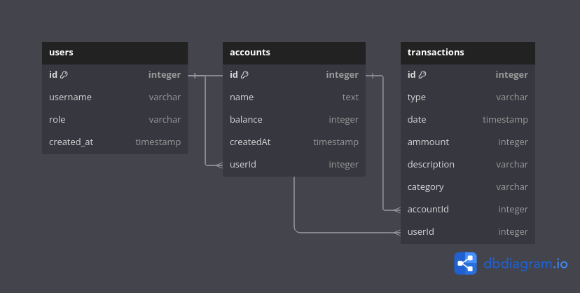

# 🐷 ReConta

<p style="text-align: center;">
  
</p>

[](https://github.com/sistematico/reconta/actions/workflows/deploy.yml)

## Diagrama do Banco de Dados



## 🗺️ Ecossistema

| Descrição | Produção | Desenvolvimento | README |
| --- | --- | --- | --- |
| Site | [https://reconta.app](https://reconta.app) | [http://localhost:5030](http://localhost:5030) | [README.md](./apps/site/README.md) | 
| API | [https://api.reconta.app](https://api.reconta.app) | [http://localhost:3030](http://localhost:3030) | [README.md](./apps/api/README.md) | 

## 👷 Uso

Instalar as dependências:

```bash
bun install
```

Rodar em modo de desenvolvimento:

```bash
bun apps/site/index.ts
```

## 🛠️ Stack

- [Bun](https://bun.sh/)
- [Vue.js](https://vuejs.org/)
- [Vite](https://vitejs.dev/)
- [Hono](https://hono.dev/)
- [Drizzle](https://orm.drizzle.team/)

## 🕐 ChangeLog

- `2024/09/26` - Basic scaffolding using [Bun Workspaces](https://github.com/sistematico/bun-workspaces-template)

This project was created using `bun init` in bun v1.1.29.
[Bun](https://bun.sh) is a fast all-in-one JavaScript runtime.
